# cg
Computer Graphics Lab

# 依赖关系
依赖于GLUT
Windows用户下载地址: https://www.opengl.org/resources/libraries/glut/

Linux:
```
sudo apt install cmake g++ freeglut3-dev
```

# 编译
Windows用户可以把src和include目录的文件加入到VS的C++项目中, 或者使用Cmake配置.

Linux:
```
mkdir -p build
cd build
cmake ..
make
```
命令将生成可执行文件`cg`, 双击打开即可.

# 运行
预编译了Windows的EXE文件, 在release中可以下载.
右键弹出菜单选择功能.

# 图集
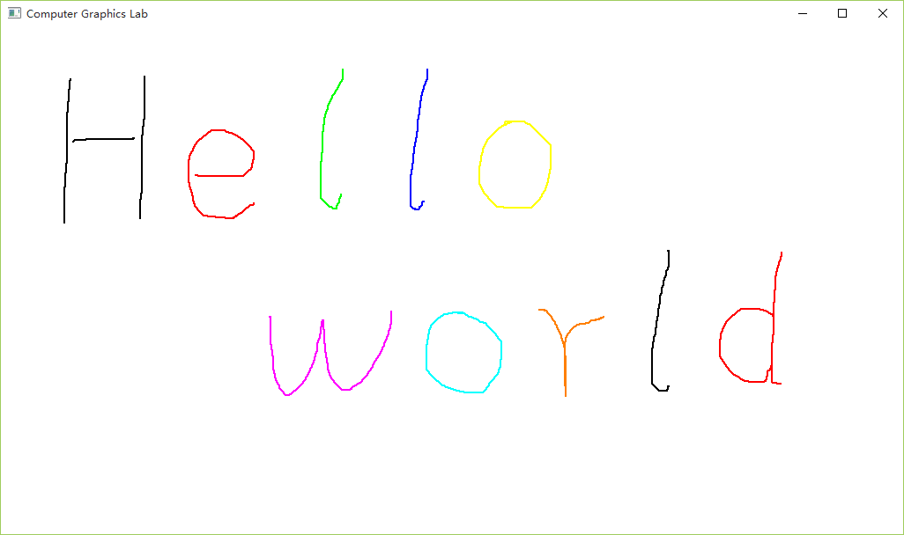
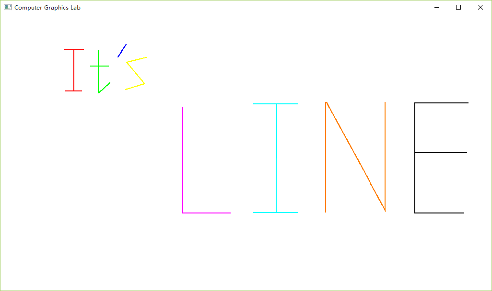
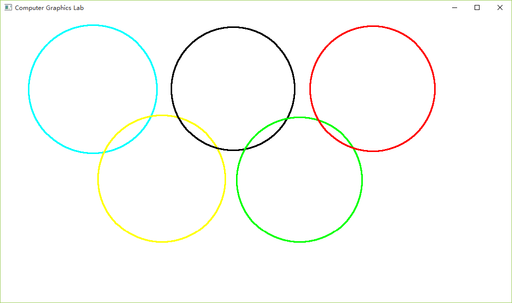
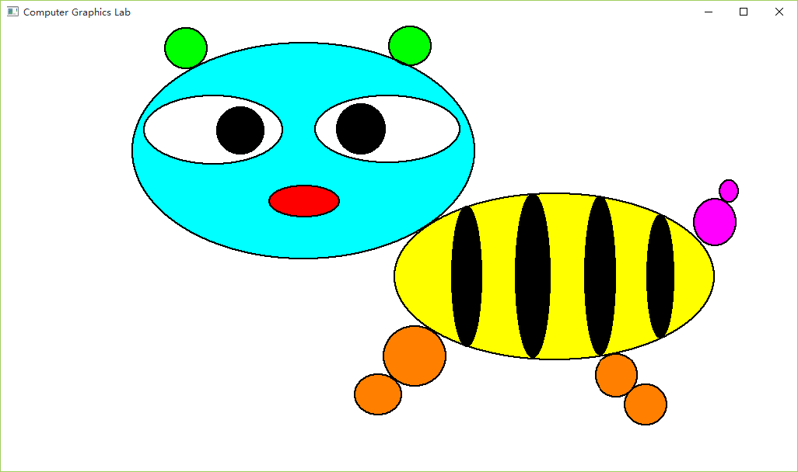
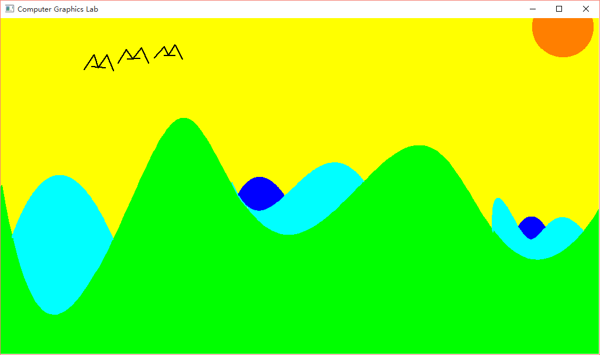
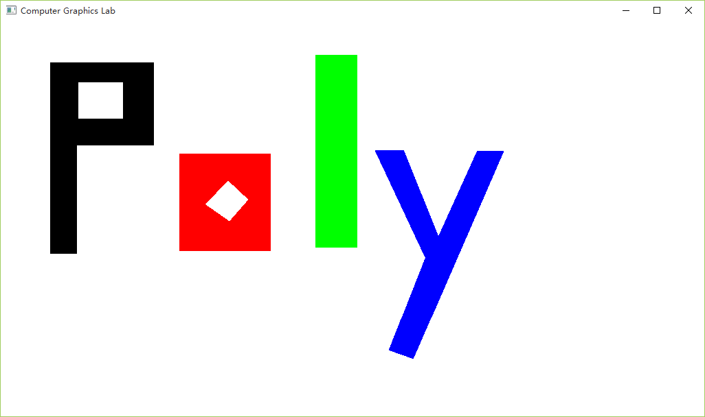
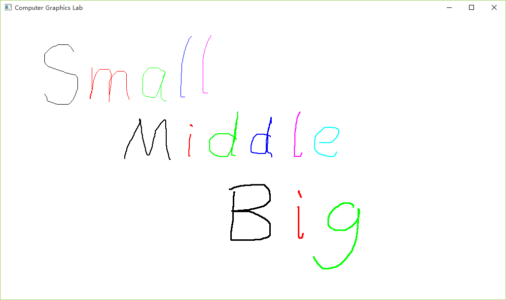
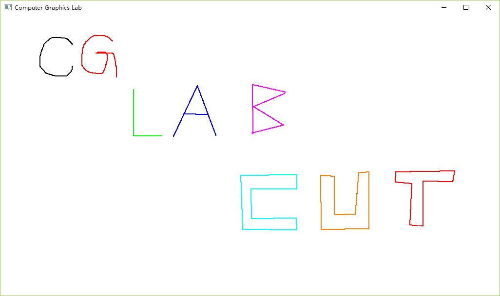
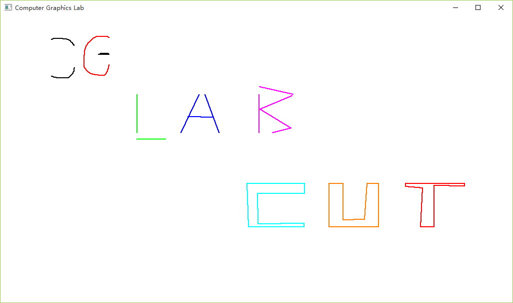
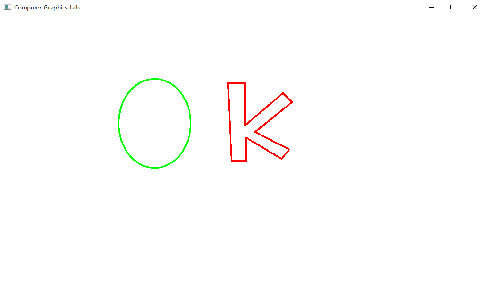
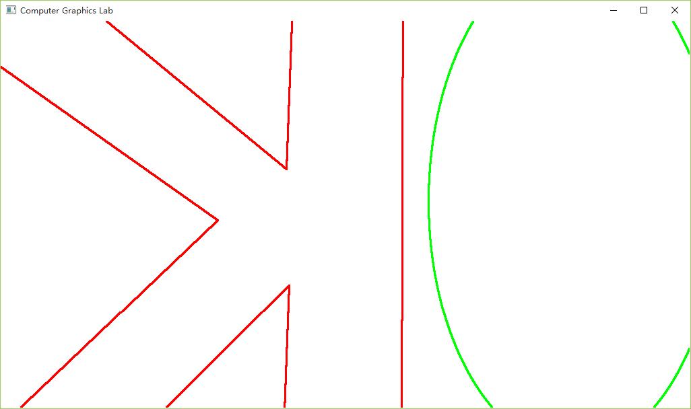